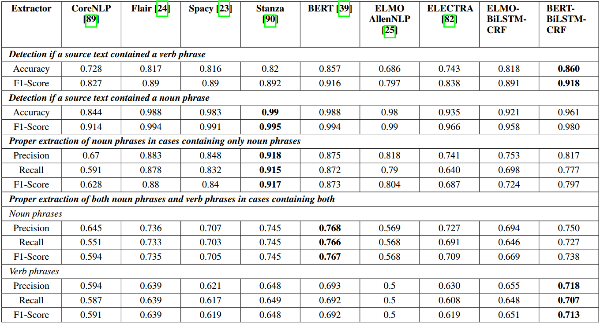

# m2m-nlp-experiment
Experimental code for extracting verb-noun phrases and relations from graphical models (such as UML use case or BPMN process models), 
with intent to apply them to generate outputs for model-to-model transformations.

### Requirements

Environment should be setup by simply running 
```shell
sh setup_env.sh
```
It is recommende to install it into separate environment.

### Running the code

To run the experiments, simply execute `experiment.py` with appropriate parameters:
```shell
usage: experiment.py [-h] [--processor {spacy,stanza,flair,corenlp,bert,allen,simple,elmo-lstm,bert-lstm,xlm-roberta,electra}] --input-file INPUT_FILE [--task {phrases,ner}] [--column COLUMN] [--normalize-verbs]
                     [--output-file OUTPUT_FILE]

optional arguments:
  -h, --help            show this help message and exit
  --processor {spacy,stanza,flair,corenlp,bert,allen,simple,elmo-lstm,bert-lstm,xlm-roberta,electra}
                        Used extraction processor
  --input-file INPUT_FILE
                        Input dataset file which will be processed
  --task {phrases,ner}  Task type
  --column COLUMN       Column index for processing
  --normalize-verbs     Use verb normalization
  --output-file OUTPUT_FILE
                        Output file
```
The dataset (input) files cane be found in the `datasets` folder.

### Performance



### Citation

The following papers contain results of this research:

```bibtex
@article{Danenas2020,
  title={Extending Drag-and-Drop Actions-Based Model-to-Model Transformations with Natural Language Processing}, 
  author={Danenas, Paulius and Skersys, Tomas and Butleris, Rimantas}, 
  journal={Applied Sciences}, 
  publisher={MDPI AG}, 
  volume={10}, 
  number={19},
  year={2020}, 
  month={Sep}, 
  pages={6835},
  ISSN={2076-3417}, 
  url={http://dx.doi.org/10.3390/app10196835}, 
  DOI={10.3390/app10196835}
}
@article{Danenas2022,
  title={Exploring Natural Language Processing in Model-To-Model Transformations},
  author={Danenas, Paulius and Skersys, Tomas},
  journal={IEEE Access},
  year={2022},
  volume={10},
  pages={116942-116958},
  doi={10.1109/ACCESS.2022.3219455}
}
```

